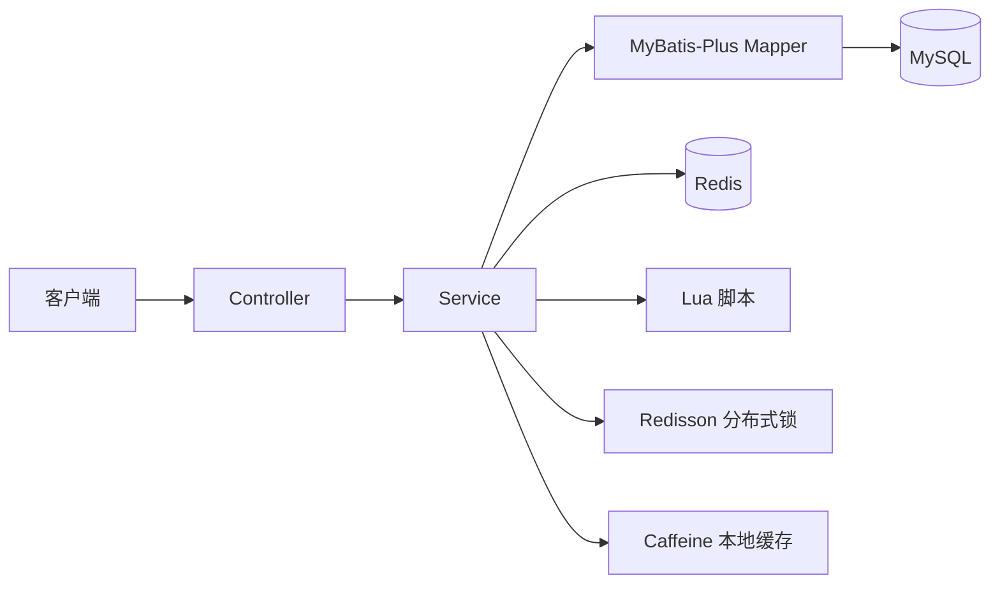
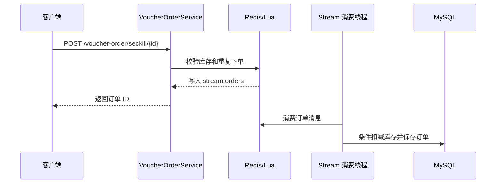

# hm-dianping

`hm-dianping` 是一个基于 Spring Boot 的本地生活服务后端示例。项目围绕用户登录、店铺检索、探店内容、关注关系和优惠券秒杀展开，用 MySQL 保存业务数据，并用 Redis 实现登录态、缓存、附近店铺、Feed、点赞排行、签到、分布式 ID、分布式锁与秒杀资格校验。

> 本仓库只包含后端服务。接口统一返回 `Result` 结构，默认监听 `8081` 端口。

## 功能概览

- 手机号验证码登录：验证码和登录会话保存在 Redis，首次登录会自动创建用户。
- 店铺服务：店铺详情缓存、按名称或类型分页、基于 Redis GEO 的附近店铺查询。
- 内容互动：发布探店笔记、热门笔记、点赞及点赞用户排行。
- 社交关系：关注、取关、共同关注，以及基于 Redis ZSet 的关注 Feed 滚动分页。
- 用户签到：使用 Redis Bitmap 记录签到并统计连续签到天数。
- 优惠券：普通券、秒杀券、按店铺查询优惠券；查询层支持 MySQL、Redis、Caffeine 三种模式。
- 秒杀下单：Redis Lua 原子校验库存与一人一单，Redis Stream 承载异步订单消息，Redisson 锁和数据库条件更新负责落库阶段的并发保护。
- 接口限流：基于 Redis ZSet + Lua 的滑动窗口限流，当前应用于店铺类型查询接口。

## 技术栈

| 类别 | 技术 |
| --- | --- |
| 语言与框架 | Java 8、Spring Boot 2.3.12.RELEASE |
| 数据访问 | MyBatis-Plus 3.4.3、MySQL Connector/J 5.1.47 |
| Redis | Spring Data Redis 2.6.2、Lettuce 6.1.6.RELEASE |
| 并发与缓存 | Redisson 3.13.6、Caffeine |
| 工具与测试 | Hutool 5.7.17、Lombok、Spring Boot Test |
| 构建工具 | Maven |

## 架构



主要目录：

```text
src/main/java/com/hmdp/
├── config/       # Web、MyBatis、Redisson 与缓存配置
├── controller/   # REST API
├── service/      # 业务接口、实现及优惠券缓存
├── mapper/       # MyBatis-Plus Mapper
├── entity/       # 数据实体
├── dto/          # 接口 DTO
├── limiter/      # 滑动窗口限流注解与切面
└── utils/        # Redis 缓存、ID、锁、登录拦截器等

src/main/resources/
├── application.yaml       # 应用配置
├── db/hmdp.sql            # 数据库表结构与示例数据
├── mapper/VoucherMapper.xml
├── limiter.lua            # 滑动窗口限流
├── seckill.lua            # 秒杀资格校验与消息入队
└── unlock.lua             # Redis 锁释放脚本
```

## 运行环境

- JDK 8
- Maven
- MySQL（初始化脚本导出自 MySQL 5.6）
- Redis（需支持 Lua、Stream、GEO、Bitmap 和 ZSet）

## 本地启动

1. 创建名为 `hmdp` 的 MySQL 数据库，并导入 `src/main/resources/db/hmdp.sql`。
2. 启动 MySQL 和 Redis。
3. 按本机环境修改 `src/main/resources/application.yaml` 中的数据库连接、Redis 地址及缓存策略。
4. 安装依赖并编译：

   ```bash
   mvn clean compile
   ```

5. 启动服务：

   ```bash
   mvn spring-boot:run
   ```

服务默认地址为 `http://localhost:8081`。

其他常用命令：

```bash
# 运行测试（集成测试依赖可用的 MySQL 和 Redis）
mvn test

# 跳过测试构建可执行包
mvn clean package -DskipTests
```

### 关键配置

| 配置项 | 默认值 | 说明 |
| --- | --- | --- |
| `server.port` | `8081` | HTTP 服务端口 |
| `spring.datasource.url` | `jdbc:mysql://127.0.0.1:3306/hmdp...` | MySQL 连接地址 |
| `spring.redis.host` / `port` | `localhost` / `6379` | Redis 地址 |
| `hmdp.cache.voucher-list.mode` | `mysql` | 优惠券列表模式：`mysql`、`redis` 或 `caffeine` |
| `hmdp.cache.voucher-list.refresh-after-write` | `5s` | Caffeine 写入后的刷新时间 |
| `hmdp.cache.voucher-list.expire-after-write` | `10m` | Caffeine 硬过期时间 |
| `hmdp.cache.voucher-list.redis-ttl` | `30m` | Redis 优惠券列表缓存时间 |

图片上传目录目前由 `SystemConstants.IMAGE_UPLOAD_DIR` 固定为 Windows 路径，换环境运行上传功能前需要调整该常量并准备对应目录。

## 登录与鉴权

1. 调用 `POST /user/code?phone=手机号` 获取验证码。当前示例不接入短信服务，验证码会以 debug 日志输出，并在 Redis 中保存 2 分钟。
2. 调用 `POST /user/login`，请求体传入 `phone` 和 `code`，成功后响应数据为 token。
3. 访问受保护接口时携带请求头：

   ```http
   authorization: <token>
   ```

登录拦截器当前放行 `/shop/**`、`/voucher/**`、`/shop-type/**`、`/upload/**`、`/blog/hot`、`/user/code` 和 `/user/login`，其他接口需要有效 token。

## 主要接口

| 模块 | 方法与路径 | 说明 |
| --- | --- | --- |
| 用户 | `POST /user/code` | 生成登录验证码 |
| 用户 | `POST /user/login` | 验证码登录 |
| 用户 | `GET /user/me` | 当前登录用户 |
| 用户 | `POST /user/sign` | 当日签到 |
| 用户 | `GET /user/sign/count` | 连续签到天数 |
| 店铺 | `GET /shop/{id}` | 店铺详情 |
| 店铺 | `GET /shop/of/type` | 按类型分页；提供 `x`、`y` 时按 5 公里范围距离排序 |
| 店铺 | `GET /shop/of/name` | 按名称分页搜索 |
| 博客 | `GET /blog/hot` | 热门探店笔记 |
| 博客 | `POST /blog` | 发布探店笔记 |
| 博客 | `PUT /blog/like/{id}` | 点赞或取消点赞 |
| 博客 | `GET /blog/of/follow` | 查询关注 Feed |
| 关注 | `PUT /follow/{id}/{isFollow}` | 关注或取关用户 |
| 关注 | `GET /follow/common/{id}` | 查询共同关注 |
| 优惠券 | `GET /voucher/list/{shopId}` | 店铺优惠券列表 |
| 秒杀 | `POST /voucher-order/seckill/{id}` | 秒杀下单 |

Controller 中的完整接口及参数定义见 `src/main/java/com/hmdp/controller/`。

## 秒杀链路



运行该链路前需要注意：

- 秒杀券写入数据库后，还需要为 `seckill:stock:{voucherId}` 准备对应的 Redis 库存。
- `stream.orders` 的消费者组需要预先存在。
- 当前 `VoucherOrderServiceImpl` 中启动消费线程的 `@PostConstruct` 初始化代码默认被注释；未启用时 Lua 仍会返回订单 ID，但异步消息不会落库。
- 消费代码读取 `stream.orders`，但确认消息时使用的 key 为 `s1`。启用消费前应统一 Stream key，并同时核对 Redis 库存、订单集合和 MySQL 库存/订单的一致性。

## 数据与测试说明

- `src/main/resources/db/hmdp.sql` 会删除并重建相关表，请勿直接用于包含重要数据的数据库。
- `HmDianPingApplicationTests` 和 `RedissonTest` 是依赖真实 Redis/MySQL 的集成测试，不是隔离的纯单元测试。
- `POST /user/logout` 当前返回“功能未完成”；`BlogCommentsController` 暂未提供具体接口。

## 开发约定

- Controller 只负责请求入口和统一结果返回，业务逻辑放在 Service 层，数据库访问放在 Mapper 层。
- 修改店铺数据后应同步处理缓存失效。
- 修改秒杀流程时，应同时验证 Lua 资格校验、消息消费、Redis 状态与 MySQL 库存/订单的一致性。
- 项目补充文档位于 `.cursor/rules/ai-readme/`，其中 `manual/` 用于沉淀人工维护的业务知识与历史经验。
